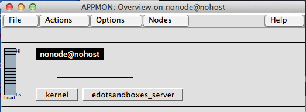

# edotsandboxes

This tutorial builds a massively multiplayer board game in Erlang and
HTML5.

The game is based on the old pen and paper game, [dots and
boxes](http://en.wikipedia.org/wiki/Dots_and_Boxes).

The premise of the game is fairly simple (from Wikipedia):

> Starting with an empty grid of dots, players take turns, adding a
> single horizontal or vertical line between two unjoined adjacent
> dots. A player who completes the fourth side of a 1×1 box earns one
> point and takes another turn. (The points are typically recorded by
> placing in the box an identifying mark of the player, such as an
> initial). The game ends when no more lines can be placed. The winner
> of the game is the player with the most points.

## Specification

Before we start we will need to define what we want.  We need to start with
a rough specification.

 1. Players can join games
 2. Players can make themselves available to play a game
 2. Players can choose to pick an opponent randomly
 3. Players can choose to pick an opponent by name
 4. Players can interface with the game using an HTML5 client

For flexibility, we will probably want to break up the game into two 
applications, a game server and an HTML5 client.  Breaking up the
service in this way will allow us to create future frontend interfaces
to this game.  Having a game server also enables us to play the game
in the Erlang shell or in a testing framework to ensure that it all
functions correctly without involving HTML or a browser.

We'll put off the details of the HTML5 client for now and concentrate
on the game server. Just by the simple specification we can devise
what agents are needed in this system.

The most obvious actor is a `Player`.  We also need some kind of actor
that keeps track of who is who and their availibility.  We will call
this actor a `Bouncer`. Finally we need an actor who keeps track of
the game's state.  We'll call that actor a `Game Master`.

The beauty of Erlang is that actors in a system often map 1 to 1 to
processes representing those actors.  I often unintentionally picture
these processes in my head as living, breathing entities who have
strict jobs to do in this system.  Erlang starts to feel a lot like
Tron to me.  Not all of these entities will become processes in our
service, but it is good habit to think about which actors will be present in
our system.

## Creating the edotsandboxes_server application

Erlang/OTP has a way bundle up modules into a single component that solves a
single purpose.  OTP calls this component an application.

Applications have single supervisor that watches over an application's core
processes. 

The OTP convention is to keep these applications in a `apps/`
directory if a project is a composite of applications. Project that are made
up of a single application simple have a `src/` directory and no
`apps/` directory that contains multiple application root.

The directory structure for an OPT application contains the following:

    `ebin/`    - .beam files and .app files
    `include/` - .hrl header files
    `priv/`    - non-code resources
    `src/`     - code!

Not all these directories are required.  Obviously you probably need a
`src/` directory:

    mkdir -p apps/edotsandboxes_server/src

Now that we got that out of the way, let's create our
edotsandboxes_server application:

    cd apps/edotsandboxes_server
    rebar create-app appid=edotsandboxes_server

The output should show that some files were created in `src/`:

    ==> edotsandboxes_server (create-app)
    Writing src/edotsandboxes_server.app.src
    Writing src/edotsandboxes_server_app.erl
    Writing src/edotsandboxes_server_sup.erl

You can compile this application and even start our application even
though it doesn't do anything:

    rebar compile

We can start our application:

    erl -pa ebin -eval "application:start(edotsandboxes_server)." -s appmon

This starts our application and starts the
[appmon](http://www.erlang.org/doc/man/appmon.html) graphical application
monitor.  

The main window, displays the currently running:

If you click on the `edotsandboxes_server` button, the application's process
will be displayed:

Finally, if you click on the `edotsandboxes_server_sup` process, you will see the
process's info:

This data is useful for debugging

## Conclusion

This concludes part one of this tutorial.  We created a basic service
specification, identifed the actors in our system and created our
first application.

In the next installment, we'll write the code for the Game Master
`gen_server`.
